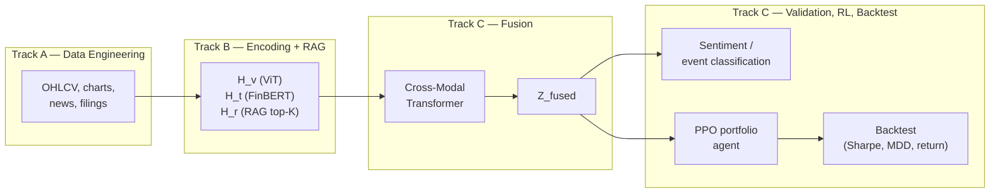

# MultiFinRL

**A Multimodal Retrieval-Augmented Financial Decision Framework with Reinforcement Learning**

MultiFinRL turns three kinds of daily market data — two market charts (candlestick + volume), financial news (text), and filings / earnings-call transcripts (external knowledge) — into a single vector, `Z_fused`, that represents a stock's market state on a given trading day. A shared-weight dual-image vision encoder (ViT), a text encoder (FinBERT), and a retrieval-augmented generation (RAG) module process those inputs; a Cross-Modal Transformer fuses H_v/H_t/H_r into `Z_fused`. That vector is then used both to validate market-sentiment classification and event extraction, and as the state input for a PPO reinforcement-learning agent that allocates a portfolio.

---

| Phase | Goal |
|---|---|
| Phase 1 | Build the full data-to-`Z_fused` pipeline; validate `Z_fused` quality via market-sentiment classification and event extraction; run a simple portfolio backtest (single-stock position sizing or a small multi-asset mix). |
| Phase 2 | Connect `Z_fused` to a PPO agent for portfolio allocation; run a full backtest; compare performance with and without RL (Sharpe ratio, max drawdown, etc.). |

Both phases run within the same year and the pipeline is expected to cover the output of both — classification, event extraction, a simple backtest, and an RL-based backtest — not one phase per year.

## Architecture



This runs once per trading day for the configured date range, producing one `Z_fused` vector per day — several thousand for a multi-year run on a single stock.

---

## Ownership and Directory Layout

|---|---|---|---|
| A | `module_a_data/` | Data engineering: crawlers, chart generation, text cleaning, chunking, price-movement labels | One JSON record per day (`data/processed/dataset/`) |
| B | `module_b_encoder/` | ViT / FinBERT encoding, RAG index and retrieval, event extraction | Daily `H_v`, `H_t`, `H_r` vectors (`data/vectors/`) in a fixed format |
| C | `module_c_fusion/` | Cross-Modal Transformer, classification validation, PPO, backtesting | A system that outputs portfolio recommendations from market state, plus backtest reports |

Shared code (schema validation, path constants, utilities) lives in `shared/` and is jointly maintained; changes there should be flagged to the other tracks before merging.

## Repository Structure

```
MultiFinRL/
├── README.md                       # this file
├── requirements.txt                 # single source of truth for the dev environment
├── .gitignore
├── configs/
│   └── config.yaml                  # global parameters: tickers, date range, chart/label settings
├── docs/
│   ├── data_format.md               # data contract between A / B / C
│   ├── decisions.md                 # decision log, including open questions
│   ├── data_and_experiments_log.md  # data sources and classification results over time
│   ├── conduct_script.md            # copy-paste command cheat sheet, A → B → C → decoder
│   ├── project_status_2026-08.md    # current status vs. the formal proposal, section by section
│   ├── decoder_finetuning_summary.md   # decoder QLoRA fine-tuning: method, LoRA scope, training setup
│   ├── spec_b_event_extraction_llm.md  # spec: LLM-based event extraction (implemented, see decisions.md #35)
│   └── reference/
│       ├── 115WFAA310699_CM03.pdf              # the formal grant proposal — source of truth
│       ├── 115WFAA310699_CM03_extracted_text.txt
│       └── README.md
├── samples/
│   ├── DataStruct.example.json      # example of A's output format
│   └── vectors_index.example.json   # example of B's output format
├── shared/
│   ├── schemas.py                   # validates records against the data contract
│   ├── paths.py                     # path constants
│   └── utils.py
├── module_a_data/                   # Track A — data engineering
│   ├── README.md
│   ├── crawler/
│   │   ├── fetch_ohlcv.py           # OHLCV via yfinance
│   │   ├── fetch_news.py            # recent news
│   │   ├── fetch_news_alpaca.py     # historical news backfill via Alpaca News API
│   │   ├── fetch_filings.py         # SEC EDGAR filings (10-K/10-Q only, no 8-K — see decisions.md #41)
│   │   ├── fetch_transcripts.py     # earnings-call transcripts via Alpha Vantage API (ALPHA_VANTAGE_API_KEY)
│   │   └── fetch_macro.py           # ETF/index macro data — scaffold only, not implemented (decisions.md #38)
│   ├── preprocess/
│   │   ├── chart_generator.py       # mplfinance candlestick charts, 20-day window
│   │   ├── text_cleaner.py          # HTML/noise cleanup (news + filing-specific iXBRL/hidden-content stripping)
│   │   └── chunker.py               # document chunking (≤512 tokens)
│   ├── labeling.py                  # BULLISH / BEARISH / NEUTRAL label generation (quantile thresholds)
│   └── build_dataset.py             # assembles the daily JSON records
├── module_b_encoder/                # Track B — encoders + RAG + event extraction
│   ├── README.md
│   ├── encoders/
│   │   ├── vision_encoder.py        # ViT -> H_v
│   │   └── text_encoder.py          # FinBERT -> H_t
│   ├── rag/
│   │   ├── vector_db.py             # FAISS index over filing/transcript chunks
│   │   └── retriever.py             # top-K retrieval -> H_r
│   ├── event_extraction.py          # keyword or --method llm; standalone Track A data-quality check, does not touch Z_fused
│   ├── event_ground_truth_llm.py    # LLM-assisted ground truth labeling for event_extraction.py
│   ├── event_ground_truth_prompt.py # shared prompt used by the above and event_extraction.py --method llm
│   ├── llm_client.py                 # shared LLM-calling helpers (claude/openai/deepseek)
│   └── generate_vectors.py          # main entry point: produces H_v / H_t / H_r per day
├── module_c_fusion/                 # Track C — fusion, validation, decoder, RL, backtest, explainability
│   ├── README.md
│   ├── fusion/
│   │   ├── model.py                 # Cross-Modal Transformer
│   │   ├── train.py                 # trains the fusion model, exports Z_fused
│   │   └── consolidate.py           # merges per-day Z_fused into one index file
│   ├── validation/
│   │   ├── classifier.py            # diagnostic probe: Z_fused -> market sentiment (3-class)
│   │   └── event_validation_head.py # diagnostic probe: Z_fused -> event types (7-class multi-label)
│   ├── decoder/                     # Z_fused -> structured belief narrative (proposal sec. 3.4/3.5)
│   │   ├── model.py                 # ZFusedProjector + QLoRA LLaMA-2-7b backbone (4-bit)
│   │   ├── train.py                 # QLoRA fine-tuning, L_belief loss, time-based train/val/test split, --resume
│   │   ├── evaluate.py              # held-out test loss delta, tag accuracy, optional LLM-as-judge
│   │   ├── generate_y_belief.py     # LLM-bootstrapped training target (trend from A's label, risk/narrative from LLM)
│   │   ├── y_belief_prompt.py       # prompt for generate_y_belief.py
│   │   └── judge_prompt.py          # prompt for evaluate.py's optional LLM-as-judge
│   ├── explainability/
│   │   └── integrated_gradients.py  # cross-modal attribution on the PPO policy (captum)
│   ├── rl/
│   │   ├── env.py                   # PPO environment and reward function
│   │   └── train_ppo.py             # --curriculum for volatility-staged curriculum learning
│   └── backtest/
│       └── backtest.py              # cumulative return, Sharpe ratio, max drawdown (single-ticker only)
├── scripts/
│   └── run_pipeline.py              # runs A -> B -> C end to end
└── data/                            # not tracked in git except data/labels/; synced locally/via cloud storage
    ├── raw/                         # Track A's raw inputs (ohlcv, charts, news, filings, transcripts)
    ├── processed/dataset/           # Track A's deliverable: one JSON per day
    ├── vectors/                     # Track B's deliverable: .npy vectors + index JSON
    ├── outputs/                     # Track C's output: model checkpoints, Z_fused, backtest reports
    └── labels/                      # ground truth labels (event ground truth) — the one data/ subfolder tracked in git
```

## Data Flow

Full definition in `docs/data_format.md`; the handoff points are:

1. **A → B**: `data/processed/dataset/{TICKER}/{YYYY-MM-DD}.json` — one record per day, containing the chart path, a news list (with a `days_ago` field), filing/transcript chunks, and the price-movement label.
2. **B → C**: `data/vectors/{TICKER}/{YYYY-MM-DD}/` — `H_v.npy`, `H_t.npy`, `H_r.npy`, plus an `index.json` recording shapes and sources.
3. **C output**: `data/outputs/` — `Z_fused` (per day and as a consolidated index), model checkpoints, and backtest reports.

## Global Specifications

| Item | Spec |
|---|---|
| Market / initial universe | US equities, starting with AAPL; expansion to more large-cap names (e.g. NVDA) is a later step. Indices/ETFs are excluded for now since they have no filings. |
| Data range | 2021-01 onward, continuously extended (currently through 2026-08; see `configs/config.yaml`) |
| Charts | 20-day trailing window, PNG, 224×224, RGB |
| Price-movement label | Return from close to the close 5 trading days later: > +2% → BULLISH, < −2% → BEARISH, otherwise NEUTRAL |
| Text chunking | ≤512 tokens per chunk (FinBERT's input limit) |
| RAG retrieval | top-K = 3 |
| Missing daily news | backfilled from prior days, with a `days_ago` field so the model can weigh relevance |
| Fine-tuning | Fusion model (`fusion/train.py`): full-parameter training. Decoder (`decoder/train.py`): QLoRA (4-bit, LoRA on all attention+MLP linear layers) fine-tuning LLaMA-2-7b, in progress |
| Dev environment | `requirements.txt` in this repo is the single source of truth |

## Current Status and Roadmap

Operational today, on AAPL:

- Data (A): OHLCV, charts, recent news, and historical news (via the Alpaca News API, 2021–2026) are all in place. Filings, including 8-K, are fetched via the SEC EDGAR official API (`fetch_filings.py`; an alternate `edgartools`-based fetcher was evaluated as a candidate but never actually produced any data and has been removed, `docs/decisions.md` #31, #41). Earnings-call transcripts switched from an unreliable third-party scraper (`foolcalls`, never completed an end-to-end run, removed) to the official Alpha Vantage API (`fetch_transcripts.py`, needs `ALPHA_VANTAGE_API_KEY`).
- Encoding (B): ViT and FinBERT encoders and FAISS-based RAG retrieval are working. Event extraction has a 149-day LLM-labeled ground truth (`data/labels/event_ground_truth/`) and two extraction methods: the default keyword rules (precision/recall/F1 0.162 / 0.868 / 0.273 on AAPL) and an LLM-based method (`--method llm`, `docs/spec_b_event_extraction_llm.md`) that measured 0.742 / 0.605 / 0.667 on the same 149-day sample (f1 +144%); a full 1381-day run has completed, with 401 days showing at least one detected event.
- Fusion and validation (C): the Cross-Modal Transformer, held-out classification validation, event validation head (multi-label probe of Z_fused against the same ground truth, micro F1 0.229 on AAPL), PPO training (with optional `--curriculum` volatility-staged training), Integrated Gradients attribution on the PPO policy, and backtesting (buy-and-hold / rule-based / PPO strategies) all run end to end. Class-weighted training is the current default after diagnostic testing showed it was necessary for the model to learn anything from the news input at all.
- Decoder (C, `module_c_fusion/decoder/`): implemented and training (2026-08). `Z_fused` is used as a soft-prompt prefix into a frozen, 4-bit-quantized LLaMA-2-7b fine-tuned with QLoRA (LoRA on all attention+MLP linear layers), generating a structured `<TREND>`/`<RISK_LEVEL>` belief plus a short narrative — this is the L_belief loss from the original proposal. Training targets (`y_belief`) are LLM-bootstrapped: trend reuses Track A's existing quantile label, an LLM (DeepSeek) judges risk level and writes the narrative from that day's news/filings/transcripts (1223+/1381 AAPL days generated so far). Data is split 70/15/15 by time (train/val/test, no shuffling). The evaluation script (`evaluate.py`) confirmed the pipeline is correct end to end — an epoch-1 checkpoint reached 30/30 structured-format accuracy — but trend/risk-level content accuracy is still low at that early stage and full training has not yet finished, so there are no final numbers yet.
- A domain-gap comparison for ViT on candlestick charts vs. its natural-image pretraining has been run: removing the candlestick chart drops macro F1 by 51%, showing the current (non-domain-pretrained) ViT still contributes substantially (`docs/decisions.md` #46).

Known gaps, tracked in `docs/decisions.md`:

- L_align and L_ground, two of the three composite training losses in the original proposal, are not implemented. L_align needs joint training with Track B's encoders, which are currently frozen (not yet architecturally opened up); L_ground needs oracle relevance-score labels that don't exist yet. (L_belief, the third loss, is what the decoder above trains.)
- The vision encoder itself is not domain-pretrained on financial charts as the proposal specifies (still generic ImageNet ViT) — a known gap, though the domain-gap experiment above shows it's not dead weight, which lowers the urgency of replacing it.
- Multi-asset portfolio backtesting — the current backtest and RL environment allocate between a single stock and cash, not across multiple tickers. Not started.
- Whether "technical indicators" (RSI/MACD-style) should be a second chart merged into `H_v`, and whether chart pattern events (head-and-shoulders, etc.) should extend the event validation head — both confirmed in scope by the project lead but not yet implemented, non-urgent (`docs/decisions.md` #64 and the open-questions table).

## Getting Started

```bash
git clone <repo-url>
cd MultiFinRL
python -m venv .venv && source .venv/bin/activate   # Windows: .venv\Scripts\activate
pip install -r requirements.txt
```

See each module's own `README.md` for how to run it.

## Execution Order

**Phase 1 (parallel)**
- A starts pulling data, delivering an initial 50–100 sample days early.
- B wires up ViT / FinBERT / RAG against synthetic data first — one image or chunk in, one correctly formatted vector out.
- C wires up the Fusion Transformer against synthetic vectors — three vectors in, `Z_fused` out.

**Phase 2 (once A has enough real data)**
- A keeps extending coverage.
- B switches to real data, producing real `H_v` / `H_t` / `H_r`.
- C switches to real vectors and begins actual training, RL, and backtesting.

## Collaboration Guidelines

- `main` stays runnable; work happens on `feat/a-*`, `feat/b-*`, `feat/c-*` branches, merged via PR.
- Data (`data/`) is not committed to git and is synced separately; the repo holds only code and format examples.
- Any change to the **data format** must update `docs/data_format.md` and `shared/schemas.py` first, and be flagged to the other tracks before downstream code changes.
